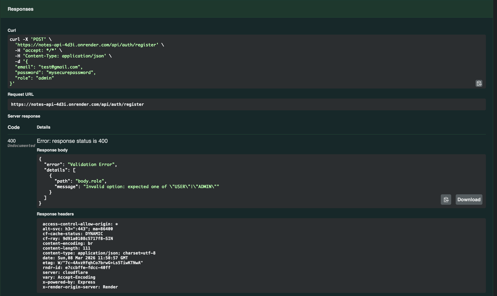
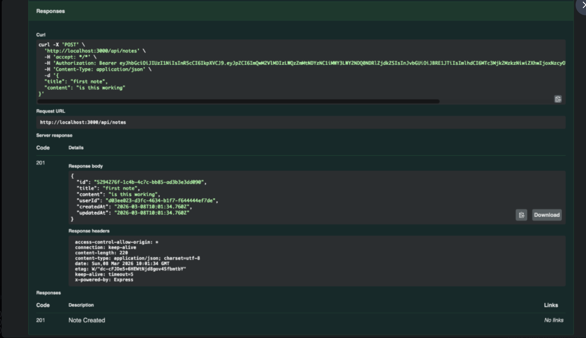

# 📝 Notes Management API

[](https://www.typescriptlang.org/)
[](https://nodejs.org/)
[](https://expressjs.com/)
[](https://www.prisma.io/)
[](https://www.postgresql.org/)

A secure, robust RESTful API for managing personal notes. Built with Express, TypeScript, PostgreSQL, and Prisma. It natively implements JWT role-based access control (RBAC), input validation via Zod, pagination, note search, and is fully documented interactively with Swagger (OpenAPI 3.0).

---

## 🌍 Live Deployment Dashboard

**Test the Live API directly in your browser:**
� **[Interactive Swagger UI Dashboard (Live)](https://notes-api-4d3i.onrender.com/api-docs)** 👈

*(Note: Because this is hosted on a free Render tier, the server will occasionally "spin down" to save resources. If this is your first time visiting the link today, please expect up to **50 seconds of loading time** before the dashboard appears!)*

---

## 📸 API Previews & Validation

**Input Validation & Error Handling (Zod)**


**Native Database Relationships (Prisma/PostgreSQL)**


---

## �🚀 Features

- **🔐 Authentication & Authorization:** Secure user registration, login, and token refresh logic using `bcrypt` and JWTs.
- **🛡️ Role-Based Access Control (RBAC):** Distinct `USER` and `ADMIN` roles. Admins have absolute system access.
- **📝 Notes CRUD:** Authenticated users can create, read, update, and delete exclusively *their own* notes.
- **🔍 Search & Pagination:** First-class support for page-based reading and title-substring note filtering.
- **✅ Strict Input Validation:** Strongly-typed API payloads verified at runtime using `Zod` to maintain data fidelity.
- **🚨 Unified Error Handling:** Intercepted architectural errors transformed into standardized, consistent JSON responses.
- **📚 Interactive Documentation:** Zero-configuration Swagger UI to interactively test endpoints locally.
- **🐳 Docker Native:** Preconfigured `Dockerfile` with multi-stage logic for effortless containerization.

---

## 🛠️ Tech Stack & Architecture

- **Runtime Environment:** Node.js (v18+)
- **Framework:** Express.js (v5)
- **Language:** TypeScript
- **ORM:** Prisma
- **Database:** PostgreSQL (Cloud Ready)
- **Validation:** Zod
- **Documentation:** SwaggerUI (YAML)

### Directory Structure
```text
/src
├── controllers      # Core business logic processing incoming HTTP requests.
├── middlewares      # Zod validation interception, JWT Auth, and Error handling.
├── routes           # Express routing definitions mapping paths to controllers.
└── utils            # Singletons like Prisma client initializations.
```

---

## ⚙️ Getting Started 

Follow these steps to quickly test and run the project locally.

### Prerequisites
Make sure you have Node Package Manager (`npm`) and Node.js (`v18+`) installed on your machine.

### 1. Installation

Clone the repository and install all node packages:

```bash
git clone <your-repo-link>
cd notes-api
npm install
```

### 2. Environment Configuration

Copy the example environment securely (or create a `.env` file at the root).

```env
PORT=3000
DATABASE_URL="file:./dev.db"
JWT_SECRET="supersecret_jwt_key_here"
```

### 3. Initialize the Database

Make sure your `.env` `DATABASE_URL` is pointing directly at your local or remote PostgreSQL instance. Then push the schema:

```bash
npx prisma db push
npx prisma generate
```

### 4. Run the Dev Server

Spin up the local backend server via nodemon for hot-reloading:

```bash
npm run dev
```

The server should output: `Server is running on port 3000`.

---

## 📖 API Documentation & Testing

Once the server is running, the fastest way to interact with the endpoints is via the built-in Swagger dashboard.

Navigate to **[http://localhost:3000/api-docs](http://localhost:3000/api-docs)**.

Here, you can:
1. Hit `POST /api/auth/register` to create a user.
2. Hit `POST /api/auth/login` to secure a returning raw JWT Token.
3. Click **Authorize** at the top right of the dashboard and insert that token to test protected routes.

---

## 🐳 Docker Local Deployment

To build and run this API completely isolated in a container:

```bash
# Build the Docker image natively
docker build -t notes-api .

# Run the container
docker run -p 3000:3000 notes-api
```

